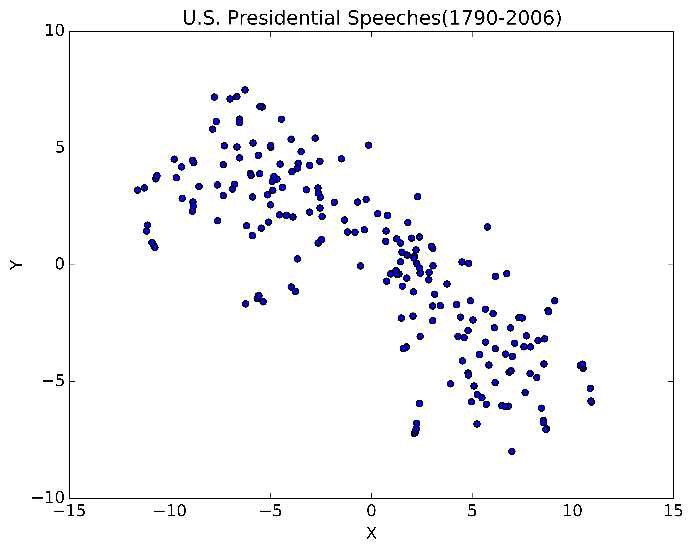

# U.S-Presidential-Speeches
Analyze the text of U.S. President's Speeches from 1790 to 2006 using [Word2Vec](https://en.wikipedia.org/wiki/Word2vec)(w2v) model in [gensim](https://radimrehurek.com/gensim/). 
<b>Note:</b> I worked on this project in July, 2014. There has been a lot of progress since then.  

- All speeches in their original format are in [speech.txt](./speech.txt)
- The processed version of the speeches such that each line contains one processed speech is in [all_speech.txt](./all_speech.txt)
- The json file containing full metadata from [speech.txt](./speech.txt) in the form of list of dictionaries is in [data_processed.txt](./data_processed.txt). It contains following key-value pairs:
  - 'who': President's name
  - 'date' : date of speech (example : January 27, 1984)
  - 'speech' : Full speech
  - 'what' :'State of the Union Address'

- The code to process [speech.txt](./speech.txt) is in [speech.py](./speech.py)
- [w2v_speech.py](w2v_speech.py) contains gensim model to learn w2v model from the speeches.
- Speech vector is calculated by averaging all the word vectors in the speech
- [w2v_tsne.py](./w2v_tsne.py) contains the code to plot 2D version of 100 dimensional speech vectors
- [speech_vectors.npy](./speech_vectors.npy) is numpy vector of all speeches as processed in [w2v_tsne.py](./w2v_tsne.py)

Here is the [t-SNE](https://en.wikipedia.org/wiki/T-distributed_stochastic_neighbor_embedding) plot of speech vectors: (labeled version is in the repo. Download the image to zoom in.)

Here is the distance matrix between speeches. Zoom in to see year of speech vectors.

